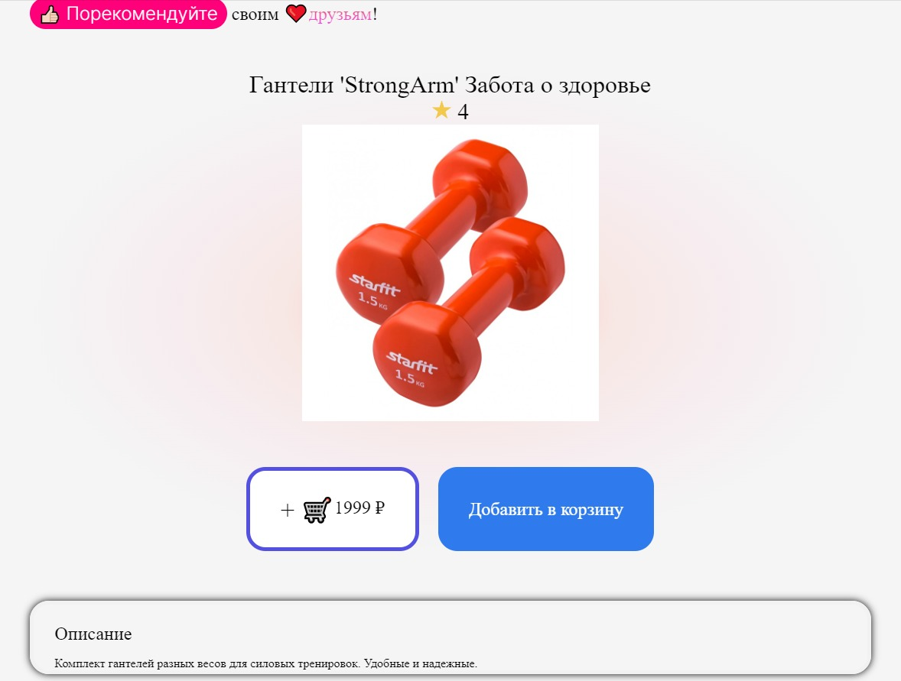

# UMOM MARKET


[]("https://learn.javascript.ru/")
[]("https://ru.vuejs.org/")
[]("https://www.python.org/")
[]("https://fastapi.tiangolo.com/")

[О проекте](#о-проекте) •
[Установка и запуск](#установка-и-запуск) •
[Запуск с докером](#запуск-с-докером) •
[Скриншоты](#скриншоты) •
[О команде](#о-команде)

## О проекте
Данный проект разработан командой umom coding во время участия в хакатоне ["На севере - кодить!"](https://насеверекодить.рф/), проходившем с 15-23 в Мурманске.

Мы выбрали кейс под номером 3 ["Городской маркетплейс нового поколения"](https://beautiful-charger-45c.notion.site/3-74e67f44d9f14f6c8c2fc44ffa2fd952).

#### Формулировка задачи:
>Разработка клиент-серверного решения, реализующего концепцию проактивного городского маркетплейса нового поколения.
>❗ Основная задача - поиск проблемных мест и решений во взаимодействиях клиента по поводу купли, продажи или организации его быта.

#### Сортировка отзывов
Одна из особенностей нашего сервиса - это сортировка отзывов.
Отзывы сортируются по "схожести с пользователем", т.е. сначала показываются отзывы от людей наиболее похожих на авторизованного пользователя. 
На скриншотах ниже показаны 2 отображения отзывов у одного товара для разных пользователей.


## Установка и запуск
> склонируйте репозиторий
```bash
$ git clone https://github.com/psihoshlem/web_marketplace.git
```
> запуск сервера:
```bash
$ cd web_marketplace/server
$ python3 -m venv mp_env
# активация виртульного окружения:
$ source ./mp_env/bin/activate # для linux
$ ./mp_env/Scripts/activate.bat # для Windows
$ pip install -r requirements.txt
$ python3 script_create_examples.py # создание тестовых данных(опционально)
$ python3 main.py
```
> запуск клиента
```bash
$ cd web_marketplace/client
$ npm i
$ npm run serve
```

## Запуск с докером

Так же Вы можете запустить наш сервис с помощью докера:
```bash
$ git clone https://github.com/psihoshlem/web_marketplace.git
$ cd web_marketplace
$ docker-compose up -d
```

## Скриншоты





## О команде

### [Арсений Ильин](https://github.com/psihoshlem)
___тимлид, backend-разработчик___

> На каждом хакатоне я делаю что-то новое для себя в плане технологий, не специально, но так получается, и после каждого хакатона я жёстко удивляюсь прогрессу команды и тому, на что мы теперь способны.

### [Иван Ежов](https://github.com/imadji)
___техлид, frontend-разработчик___

> Хакатон, это всегда стресс. Это вечные мысли о том, как сделать ту или иную задачу, или почему она не получается. Хакатон прекрасен в первую очередь тимворком и тем, что вы работаете как звенья цепи (правда если кто-то отвалиться не очень ок), а ещё самое классное чувство, это когда хакатон заканчивается. Не нравится, когда вы с командой не понимаете друг друга в некоторые моменты. Очевидно, что в хакатоне больше плюсов чем минусов.

### [Данила Вошняев](https://github.com/DanilaVoshnyaev)
___верстальщик___

> . . .

### [Артём Сидоров](https://github.com/codekidy)
___дизайнер___

> . . .